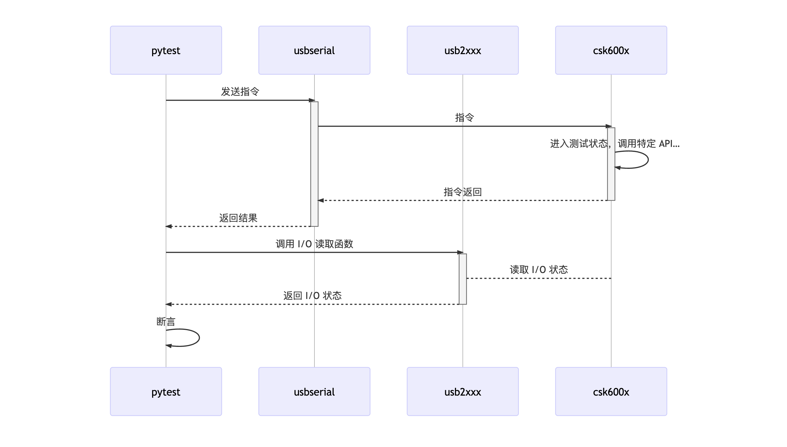

LISA B-Test Plugin
==========

## 安装

```sh
lisa install -g @lisa-plugin/btest
```

### 系统要求

* [Node 16](https://nodejs.org/en/download/)
* [Python 3.9](https://www.python.org/downloads/)
* [LISA 及 LISA Zephyr Plugin](https://docs.listenai.com/chips/600X/quick_start/installation)

除此之外，各个平台的额外需求：

#### Windows

* Windows 10 或以上，x86_64 或 ARM

#### Linux

* Ubuntu 20.04 (建议)

#### macOS

* macOS 11 (Big Sur) 或以上，Intel 或 Apple Silicon

## 概述

LISA B-Test 是一套用于对硬件进行行为测试的工作流。它基于业界常用测试框架 (目前支持 pytest)，利用 shell 调起测试固件中的对应功能，通过 usb2xxx 探测被测硬件的输出，对固件的行为进行断言。



待测硬件、调试器 (目前支持 DAPLink)、适配器 (目前支持 USB2XXX) 三者组成了一个测试套件。待测硬件与适配器应当根据测试需求进行接线，以便读取需要被断言的输出；调试器同时承担了程序烧录与串口 shell 的功能。

在一台主机上可同时接入多套测试套件，用于运行不同的测试工程。测试工程目录下的 `device-map.yml` 记录了测试工程与测试套件、套件中待测硬件、调试器、适配器的对应关系。可通过 `lisa btest dm:show` 显示，也可通过 `lisa btest dm:init` 生成。

测试工程可参照 [examples/test_gpio](examples/test_gpio/)。一个简要的测试工程结构如下：

```
|- firmware           测试固件，是一个标准的 Zephyr App 项目
|- tests              测试用例，是一个标准的 pytest 项目
|- device-map.yml     测试设备映射，通过 lisa btest dm:init 生成
\- lisa-btest.yml     测试工程配置
```

其中 `lisa-btest.yml` 示例如下：

```yml
board: csk6001_tester   # 编译测试固件时所用的 --board
test_command: pytest    # 测试命令，如使用 pytest 则是 pytest
```

通过 `lisa btest proj:build` 和 `lisa btest proj:flash` 可编译测试固件并烧录到硬件中；通过 `lisa btest run` 可运行测试。

## 快速上手

```sh
# 安装 LISA
npm install -g @listenai/lisa

# 安装 LISA Zephyr Plugin
# 配置编译环境
# 配置 Zephyr SDK
# 参照: https://docs.listenai.com/chips/600X/quick_start/installation

# 安装 LISA B-Test Plugin
lisa install -g @lisa-plugin/btest

# 进入本仓库的 example，并安装 pytest 及所需的 python 包
cd examples/test_gpio
pip install -r requirements.txt

# 连接好设备，并生成设备映射
lisa btest dm:init

# 编译测试工程，并烧录到设备中
lisa btest proj:build
lisa btest proj:flash

# 运行测试
lisa btest run
```

## 命令

```sh
lisa btest run            # 运行测试
lisa btest proj:build     # 构建测试固件
lisa btest proj:flash     # 烧录测试固件
lisa btest dm:show        # 显示设备映射
lisa btest dm:init        # 生成设备映射
lisa btest list:probe     # 列出可用的调试器
lisa btest list:shell     # 列出可用的串口设备
lisa btest list:usb2xxx   # 列出可用的 USB2XXX 设备
```

## API

### 固件 (Zephyr)

本框架提供了一些预定义的宏 (`BTEST_*`) 可方便测试固件的开发。示例如下：

```c
#include <btest/btest.h>

static int
cmd_gpio_set(const struct shell *shell, size_t argc, char **argv)
{
  // 从 argc 和 argv 可取得传入参数
  // 执行对应的测试逻辑…
  BTEST_RETURN(shell, 0)
}

BTEST_MODULE(gpio,
  BTEST_CMD(set, "Set GPIO", cmd_gpio_set),
  BTEST_CMD_END);
```

#### `BTEST_MODULE(module_name, cmds..., BTEST_CMD_END)`

定义一个测试模块。一个固件可包含多个模块，以便复用同一测试套件进行不同功能的测试。

- `module_name` - 测试模块的名称，不可带空格
- `cmds` - 使用 `BTEST_CMD` 定义的指令

#### `BTEST_CMD(cmd_name, help_text, handler_func)`

定义一个测试指令。一个模块可包含多个指令。

- `cmd_name` - 指令名，不可带空格
- `help_text` - 指令的说明，字符串
- `handler_func` - 该指令所调用的函数

#### `BTEST_RETURN(shell, code)`

- `code` 指令返回码。约定小于 0 为失败，大于或等于 0 为正常。测试用例可根据需要使用不同的正整数来表达不同含义

### Python

#### `device.load_devices(path)`

从 `path` 加载 `device-map.yml`。`device-map.yml` 可通过 `lisa btest dm:init` 生成。

#### `device.shell_open(id, baudrate=115200)`

开启一个串口 shell。

- `id` - 该串口设备的序列号，串口设备应当已在 `device-map.yml` 中定义并连接到主机上。通过 `lisa btest dm:show` 可查看当前已定义的设备映射状态，通过 `lisa btest list:shell` 获得所有已连接的串口设备
- `baudrate` - 串口设备的波特率，不传默认 `115200`

返回值：成功返回 shell 实例，失败返回 `None`

#### `device.shell_cmd(shell, module_name, cmd_name, args, wait=False`

向设备发送测试指令。

- `module_name` - 测试模块名称，由固件中的 `BTEST_MODULE` 定义
- `cmd_name` - 测试指令名称，由固件中的 `BTEST_CMD` 定义
- `args` - 指令参数，字符串，以空格分隔
- `wait` - 是否等待指令返回，返回值由固件中的 `BTEST_RETURN` 定义

返回值：若 `wait` 为 `True` 则返回指令的返回值；若 `False` 则返回 `0`

## 配置

### `lisa-btest.yml`

- `board` - 测试硬件板型，对应 `lisa zep build` 或 `west build` 的 `--board` 参数
- `test_command` - 测试命令 (如 `pytest`)，由 `lisa btest run` 执行

### `device-map.yml`

- `probe` - 调试器的序列号，可通过 `lisa btest list:probe` 获得
- `shell` - 串口设备的序列号，可通过 `lisa btest list:shell` 获得
- `usb2xxx` - USB2XXX 适配器的序列号，可通过 `lisa btest list:usb2xxx` 获得
